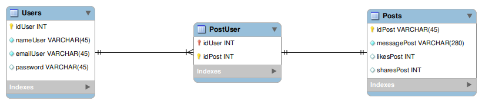

# Boas vindas ao projeto Tryitter!

Para executar o projeto, observe as orientações descritas a seguir, e se tiver qualquer dúvida, sugestão, contribuição, considere abrir uma issue ou entrar em contato conosco. 🚀

Aqui você vai encontrar os detalhes de como está estruturado e foi desenvolvido o projeto deste repositório.


# Entregas


<details>
  <summary><strong> Desenvolvimento</strong></summary><br />

  Este projeto foi desenvolvido para o Projeto Final da Aceleração de C# da Trybe em parceria com a XP, onde foi escolhido o Tema 1. 
  
  Trata-se e uma API REST desenvovida com C#, SQL Server e Azure, utilizando o Entity Framework (EF) e o JWT Authenticator. Também foi adotada a arquitetura MVC, buscando implementar os princípios Restful. Todas essas ferramentas introduzidas durante o curso da Trybe.
  
  O objetivo da aplicação desenvolvida é simular uma rede social, com um CRUD da pessoa estudante e dos seus posts.
  

  ---

  

</details>

<details>
  <summary><strong> Período de entrega</strong></summary><br />
  
  * Este projeto foi desenvolvido por Calili dos Santos Silva e Gabriel Harmel (colocar nossos links do Github)
  * Seu prazo de entrega foi o dia: `13/12/2022 23:59`

</details>


# Orientações


<details>
  <summary><strong>[EM CONSTRUÇÃO] Rodando no Docker vs Localmente</strong></summary><br />

  A aplicação foi pensada para ser testada com o Docker.
  
  Se sua opção for por usar esta ferramenta ou diretamente em sua máquina, considere as orientações abaixo.

  ## Com Docker

  > Rode o serviço com o comando `docker-compose up -d`.
  - Esse serviço irá inicializar um container chamado `tryitter_project`.
  - A partir daqui você pode rodar o container `tryitter_project` via CLI ou abri-lo no VS Code.

  > Use o comando `docker exec -it tryitter_project bash`.
  - Ele te dará acesso ao terminal interativo do container criado pelo compose, que está rodando em segundo plano.

  > Instale as dependências com `dotnet restore`.

---
  
  ## Sem Docker
  
  > Instale as dependências com `dotnet restore`
  
  ✨ **Dica:** Para rodar o projeto desta forma, obrigatoriamente você deve ter o ambiente `.NET` instalado em seu computador.

  ✨ **Dica:** Verifique se as portas (colocar as portas do banco e da API) estão disponíveis no seu computador.

---

  ## Após a instalação das dependências

  > Use os comandos `(comandos para iniciar o EF)` para utilizar o banco de dados.
  - Eles inicializam e populam o banco de dados desenvolvido com a ORM Entity Framework.

  > Inicie a aplicação com os comandos `dotnet run` ou `similar`.
  - Para executar a aplicação em sua plataforma de cliente da API.

---

  <br/>
</details>


<details>
  <summary><strong>[EM CONSTRUÇÃO] Linter</strong></summary><br />

  Foi utilizado o (pesquisar software de lint)[ESLint](https://eslint.org/) para fazer a análise estática do código.

  Este projeto já vem com as dependências relacionadas ao _linter_ configuradas no arquivos `package.json`.

  Caso queira utilizar o `ESLint` durante a execução do projeto, use o comando `npm install` dentro do projeto e depois `npm run lint`. Se a análise do `ESLint` encontrar problemas no seu código, tais problemas serão mostrados no seu terminal. Se não houver problema no seu código, nada será impresso no seu terminal.

  Você também pode instalar o plugin do `ESLint` no `VSCode`: bastar ir em _extensions_ e baixar o [plugin `ESLint`](https://marketplace.visualstudio.com/items?itemName=dbaeumer.vscode-eslint).
</details>


<details>
  <summary><strong> Testes [Em desenvolvimento]</strong></summary><br />

  Serão utilizadas as bibliotecas _xUnit_ e _FluentAssertions_ para desenvolvimento dos testes da aplicação. 

  A cobertura mínima do código definida foi de 30%, melhor descrita na seção de implementações.

  **_Para executar os testes localmente, digite no terminal o comando `dotnet test`._**

</details>

<details>
  <summary  id="diagrama"><strong>[EM CONSTRUÇÃO] Diagrama ER e Entidades</strong></summary>

  ## Diagrama de Entidade-Relacionamento


  A construção das tabelas através do ORM, seguiu o seguinte *DER*:

  

  ---

  ## Formato das entidades


  Para a criação e atualização do banco de dados foi utilizado a `Entity Framework`. 

  A partir do DER, segue os exemplos com a descrição das tabelas do banco de dados:


  - Uma tabela chamada **Users**, contendo dados com a seguinte estrutura:

    ```json
    {
      "idUser": 1,
      "nameUser": "Bill G.",
      "emailUser": "csbetterthanjava.net.com",
      "password": "secret",
    }
    ```
  - Uma tabela chamada **PostUser**, contendo dados com a seguinte estrutura:

    ```json
    {
      "idUser": 1, // Chave primária e estrangeira, referenciando o id de `Users`
      "idPost": 1, // Chave primária e estrangeira, referenciando o id de `Posts`
    }
    ```

  - Uma tabela chamada **Posts**, contendo dados com a seguinte estrutura:

    ```json
    {
      "idPost": 2,
      "messagePost": "Hello, world",
      "likesPost": 1,
      "sharesPost": 1,
    }  
    ``` 

    *Os dados acima e do banco de dados são fictícios, e estão aqui apenas para simular o funcionamento da API de acordo ao Projeto da Trybe.*

    ---

<br />

</details>

<details><summary><strong>[link do Heroku/Azure] Deploy da API</strong></summary><br />

Em construção


</details>

<details>
  <summary><strong> Mande seu feedback sobre o projeto!</strong></summary><br />

Se estiver a vontade, clone o repositório e, seja com ou sem o Docker, execute, veja o deploy e nos ajude a melhorar este projeto! Seu feedback será super bem vindo!


</details>


# Implementações


<details>
  <summary><strong> Contextualizando </strong></summary>

  A Trybe decidiu desenvolver sua própria rede social, totalmente baseada em texto. O objetivo é proporcionar um ambiente em que as pessoas estudantes poderão, por meio de textos e imagens, compartilhar suas experiências e também acessar posts que possam contribuir para seu aprendizado.💚
 
  Após muitas reuniões com todo o time que faz parte deste projeto, vocês decidiram nomear essa rede social como Tryitter, pois ela terá características próximas à estrutura de uma outra rede social já existente, o Twitter.

  Com a nossa API é permitido se cadastrar, consultar atualizar e deletar seus dados, além de  criar, consultar, atualizar e deletar os seus posts, e visualizar e interagir com os das outras pessoas estudantes.

  Sejam desenvolvedores, profissionais de tecnologia e de quaisquer áreas, estamos juntos _~~nos seus bugs~~_ na sua jornada pela Trybe e tecnologia.
  
</details>

<details>
  <summary><strong> Rotas de usuário </strong></summary>

### - Através do endpoint POST `/user`

- O endpoint é acessível através do URL `/user/`;
- O endpoint deve ser capaz de criar uma pessoa usuária com sucesso da pessoa usuária, retornando o status http `201`;
- O corpo da requisição segue o formato abaixo:
  ```json
  {
    "emailUser": "csbetterthanjava.net.com",
    "nameUser": "Bill G.",
    "password": "secret",
  }
  ```

<details>
  <summary><strong> Validações </strong></summary>

  * **[Será validado que não é possível criar uma pessoa usuária sem todas as informações necessárias]**
  - Caso um dos campos da requisição não seja informado,  o resultado retornado deverá ser conforme exibido abaixo, com um status http `400`:
    ```json
    {
      "message": "All fields must be passed"
    }
    ```

  * **[Será validado que não é possível criar uma pessoa usuária sem todas as informações válidas]**
  - Caso o campo `emailUser` não tenha um formato válido, o resultado retornado deverá ser conforme exibido abaixo, com um status http `400`:
    ```json
    {
      "message": "\"emailUser\" must be valid"
    }
    ```

  - Caso o campo `nameUser` não tenha 8 ou mais caracteres, o resultado retornado deverá ser conforme exibido abaixo, com um status http `400`:
    ```json
    {
      "message": "\"nameUser\" must have 8 or less characters"
    }
    ```

  - Caso o campo `password` não tenha 8 ou mais caracteres, o resultado retornado deverá ser conforme exibido abaixo, com um status http `400`:
    ```json
    {
      "message": "\"password\" must have 8 or less characters"
    }
    ```

</details>

---

### - Através do endpoint PUT `/user/{id}`

- O endpoint é acessível através do URL `/user/{id}`;
- O endpoint deve ser capaz de atualizar os campos da pessoa usuária com o status http `201`;
- O corpo da requisição segue o formato abaixo:
  ```json
  {
    "password": "isnosecret",
  }
  ```

<details>
  <summary><strong> Validações </strong></summary>

  * **[Será validado que não é possível atualizar os campos da pessoa usuária sem a(s) informação(ções) válida(s)]**
  - Caso o campo `emailUser` não tenha um formato válido, o resultado retornado deverá ser conforme exibido abaixo, com um status http `400`:
    ```json
    {
      "message": "\"emailUser\" must be valid"
    }
    ```

  - Caso o campo `nameUser` não tenha 8 ou mais caracteres, o resultado retornado deverá ser conforme exibido abaixo, com um status http `400`:
    ```json
    {
      "message": "\"nameUser\" must have 8 or less characters"
    }
    ```

  - Caso o campo `password` não tenha 8 ou mais caracteres, o resultado retornado deverá ser conforme exibido abaixo, com um status http `400`:
    ```json
    {
      "message": "\"password\" must have 8 or less characters"
    }
    ```

</details>

---

### - Através do endpoint GET `/user/{id}`

- O endpoint é acessível através do URL `/user/{id}`;
- O endpoint retorna todos os campos da pessoa usuária com o status http `200`;
- O corpo da resposta tem o formato abaixo:
  ```json
  {
    "emailUser": "csbetterthanjava.net.com",
    "nameUser": "Bill G.",
    "password": "secret",
  }
  ```

---

### - Através do endpoint DELETE `/user/{id}`

- O endpoint é acessível através do URL `/user/{id}`;
- O endpoint retorna o status http `204`;
- O corpo da resposta tem o formato abaixo:
  ```json
    {
      "message": "user deleted"       
    },
  ```

<details>
  <summary><strong> Validações </strong></summary>

  * **[Será validado que não é possível deletar um usuário não encontrado]**
  - Caso o id da pessoa usuária informado não seja encontrado,  o resultado retornado deverá ser conforme exibido abaixo, com um status http `404`:
    ```json
    {
      "message": "user not found"
    }
    ```

</details>

---

</details>

<details>
  <summary><strong> Rotas de posts </strong></summary>

### - Através do endpoint POST `/post`

- O endpoint é acessível através do URL `/post/`;
- O endpoint retorna o status http `201` com os dados do post criado;
- O corpo da requisição tem o formato abaixo:
  ```json
  {
    "messagePost": "Hello human",
  },
  ```

<details>
  <summary><strong> Validações </strong></summary>

  * **[Será validado que não é possível criar um post com um tamanho de mensagem não suportado]**
  - Caso o campo `messagePost` tenha menos de 1 ou mais de 280 caracteres,  o resultado retornado deverá ser conforme exibido abaixo, com um status http `400`:
    ```json
    {
      "message": "message post must have at last 1 and less than 280 characteres"
    }
    ```

</details>

---

### - Através do endpoint GET `/post`

- O endpoint é acessível através do URL `/post/{id}`;
- O endpoint retorna o status http `200` com os dados do post informado;
- O corpo da resposta tem o formato abaixo:
  ```json
  {
    "idUser": 1,
    "messagePost": "Hello, world",
    "likesPost": 1,
    "sharesPost": 1,
  },
  ```

---

### - Através do endpoint PATCH `/post`

- O endpoint é acessível através do URL `/post/{id}`;
- O endpoint retorna o status http `201` com os dados do post atualizados;
- O corpo da requisição tem o formato abaixo:
  ```json
  {
    "messagePost": "Hello robot",
  },
  ```

<details>
  <summary><strong> Validações </strong></summary>

  * **[Será validado que não é possível atualizar um post com um tamanho de mensagem não suportado]**
  - Caso o campo `messagePost` tenha menos de 1 ou mais de 280 caracteres,  o resultado retornado deverá ser conforme exibido abaixo, com um status http `400`:
    ```json
    {
      "message": "message post must have at last 1 and less than 280 characteres"
    }
    ```

</details>

---

### - Através do endpoint DELETE `/post`

- O endpoint é acessível através do URL `/post/{id}`;
- O endpoint retorna o status http `204`;
- O corpo da resposta tem o formato abaixo:
  ```json
    {
      "message": "post deleted"       
    },
  ```

<details>
  <summary><strong> Validações </strong></summary>

  * **[Será validado que não é possível deletar um post não encontrado]**
  - Caso o id do post informado não seja encontrado,  o resultado retornado deverá ser conforme exibido abaixo, com um status http `404`:
    ```json
    {
      "message": "post not found"
    }
    ```

</details>

</details>


<details>
  <summary><strong> Rotas bônus </strong></summary>

### - Através do endpoint POST `/login`

- O endpoint é acessível através do URL `/login/`;
- O endpoint deve ser capaz de fazer um login com sucesso da pessoa usuária;
- O corpo da requisição segue o formato abaixo:
  ```json
  {
    "emailUser": "csbetterthanjava.net.com",
    "password": "secret",
  }
  ```

<details>
  <summary><strong> Validações </strong></summary>

  * **[Será validado que não é possível logar uma pessoa não cadastrada no banco]**
  - Caso a pessoa não esteja cadastrada no banco o resultado retornado deverá ser conforme exibido abaixo, com um status http `404`:
    ```json
    {
      "message": "\"emailUser\" is not found"
    }
    ```

  * **[Será validado que não é possível logar uma pessoa com a senha não correspondente]**
  - Caso o campo `password` não corresponda ao cadastrado no banco para o email informado, o resultado retornado deverá ser conforme exibido abaixo, com um status http `403`:
    ```json
    {
      "message": "\"password\" is wrong"
    }
    ```
</details>

---

### - Através do endpoint GET `/post/user`

- O endpoint é acessível através do URL `/post/user/{id}`;
- O endpoint retorna o status http `200` com os dados do posts publicados pela pessoa usuária informada;
- O corpo da resposta tem o formato abaixo:
  ```json
  [
  {
    "idUser": 1,
    "messagePost": "Hello, world",
    "likesPost": 1,
    "sharesPost": 1,
  },
  {/../},
  ]
  ```
</details>

</details>

---